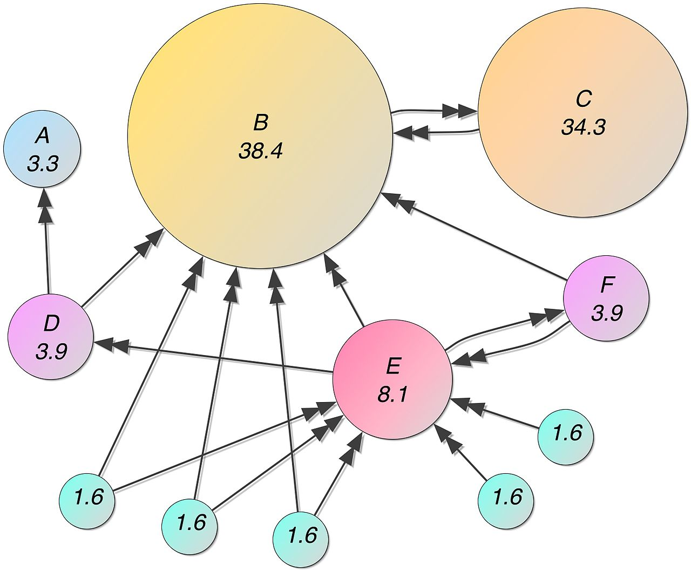

# DAT500 Project Wikipedia Search Engine using PageRank and TFIDF

## PageRank

PageRank (PR) is an algorithm used by Google Search to rank web pages in their search engine results.
PageRank was named after Larry Page, one of the founders of Google.
PageRank is a way of measuring the importance of website pages.
According to Google:

> PageRank works by counting the number and quality of links to a page to determine a rough estimate of how important the website is.
> The underlying assumption is that more important websites are likely to receive more links from other websites.

[(from Wikipedia)](https://en.wikipedia.org/wiki/PageRank)

## TFIDF

In information retrieval, tf–idf or TFIDF, short for term frequency–inverse document frequency, is a
numerical statistic that is intended to reflect how important a word is to a document in a collection or corpus.
It is often used as a weighting factor in searches of information retrieval, text mining, and user modeling.
The tf–idf value increases proportionally to the number of times a word appears in the document and is offset by the 
number of documents in the corpus that contain the word, which helps to adjust for the fact that some words appear 
more frequently in general.
tf–idf is one of the most popular term-weighting schemes today;
83% of text-based recommender systems in digital libraries use tf–idf.

Variations of the tf–idf weighting scheme are often used by search engines as a central tool in scoring and ranking a
document's relevance given a user query.
tf–idf can be successfully used for stop-words filtering in various subject fields, including text summarization and classification.

One of the simplest ranking functions is computed by summing the tf–idf for each query term;
many more sophisticated ranking functions are variants of this simple model.

[(from Wikipedia)](https://en.wikipedia.org/wiki/Tf–idf)
